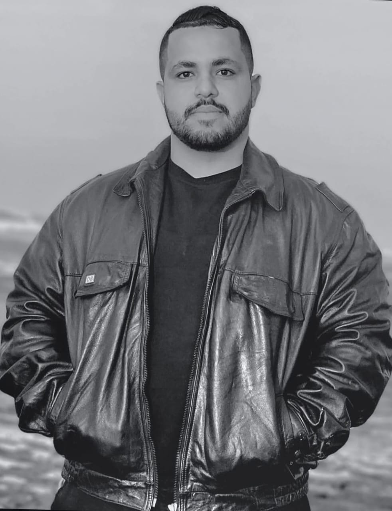
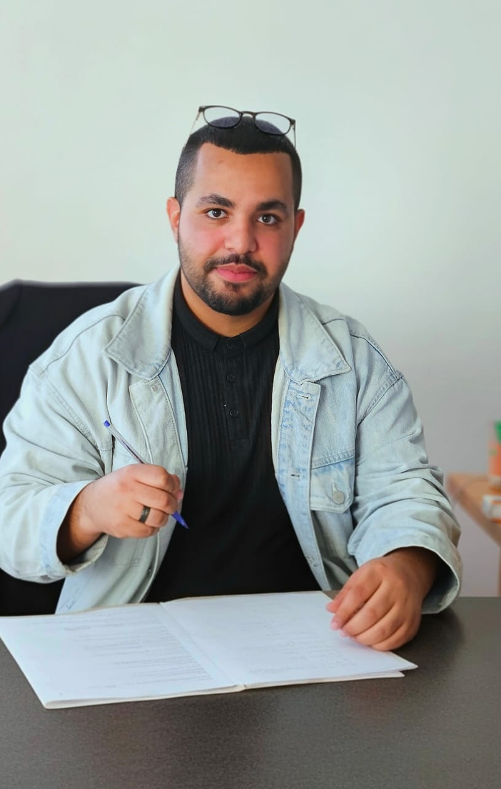

# 👋 Bienvenue sur mon profil GitHub !

 <!-- Upload image-black.jpeg dans ce dépôt pour qu'il s'affiche -->

Je m'appelle **Abdelhakmi Reda**, un **Développeur FullStack** passionné par le web et l'innovation. Diplômé d'un Master en Ingénierie Internet et Informatique à la Faculté des Sciences Ain Chock (FSAC), je me spécialise en **Symfony** et **ReactJS**. J'ai aussi de l'expérience en **Streamlit**, **Flask**, algorithmes de classification (ML), et gestion d'applications pour la FSAC. Actuellement, je travaille sur plus de 35 projets IT, en intégrant des outils comme Docker et SonarQube pour des déploiements robustes et une qualité de code optimale.

📍 **Casablanca, Maroc** | 📧 abdelhakmireda@gmail.com | ☎️ +212680667627

### 🎓 Formation
- **Master 3i (Ingénierie Internet et Informatique)** - Faculté des Sciences Ain Chock (2021-2023)
- **Licence Fondamentale SMI (Sciences Mathématiques Informatique)** - Faculté des Sciences Ain Chock (2020-2021)
- **DUT en Génie Informatique** - EST Sidi Bennour (2018-2020)
- **Baccalauréat Sciences Expérimentales Option (Sciences Physiques)** (2017-2018)

### 🛠️ Compétences Techniques

- **Méthodes** : UML, Merise, Scrum (Agile)
- **Outils** : VS Code, Laragon, XAMPP, SonarQube, Mercure, Docker
- **Autres** : Algorithmes de classification ML, Virtualisation (KVM, Libvirt)

### 💼 Expériences Clés
- **Développeur FullStack @ InteraktAgency** (Déc. 2023 - Aujourd'hui) : Migration EasyAdmin, APIs avec API Platform, front-end ReactJS, Dockerisation avec SonarQube pour l'analyse code.
- **Freelance @ Enovland** (Juill. - Déc. 2023) : App de gestion transport scolaire avec chat instantané (Mercure).
- **Freelance @ Eclipse** (Mars - Juill. 2023) : App de gestion examens avec PDF export (DOMPDF).
- **Stage @ Eclipse** (Mars - Juill. 2022) : App de gestion ordinateurs portables.
- **Projets Académiques** : Gestion d'absences (PHP), Virtualisation KVM/Django, etc.

### 📊 Mes Stats GitHub

### 🚀 Projets Phares
Regarde mes dépôts pinnés (plus de 35 projets IT en cours !) :
- [Formulaire-Dynamique-Symfony-UX-Live-Components](https://github.com/abdelhakmireda/Formulaire-Dynamique-Symfony-UX-Live-Components) : Formulaires interactifs sans JS pur.
- [Environnement-D-veloppement-Docker-Symfony](https://github.com/abdelhakmireda/Environnement-D-veloppement-Docker-Symfony) : Setup Docker pour Symfony.
- [Gestion-Absence](https://github.com/abdelhakmireda/Gestion-Absence) : App de gestion d'absences (projet académique).

Pinne tes meilleurs dépôts sur ton profil pour les mettre en avant.

### 🎥 Démo Animée
Voici une vidéo animée démontrant un de mes projets (uploadée dans le repo abdelhakmireda-fsac-gloable-project) :

<video src="https://raw.githubusercontent.com/abdelhakmireda/abdelhakmireda-fsac-gloable-project/main/myvideo.mp4" controls width="600"></video>

 <!-- Alternative image, par exemple pour un thème bleu -->

### 🌍 Langues & Loisirs
- **Langues** : Français (B2), Arabe (Courant), Anglais (Bases)
- **Loisirs** : Football ⚽, Voyage ✈️, Cyclisme 🚴, Natation 🏊

### 📫 Contacte-moi
- [LinkedIn](https://www.linkedin.com/in/abdelhakmi-reda/) <!-- Ajoute ton lien si tu en as un -->
- [Email](mailto:abdelhakmireda@gmail.com)
- [Téléphone](tel:+212680667627)

Merci d'avoir visité ! Si tu aimes, star un dépôt ou follow-moi. 😊

 <!-- Compteur de visites optionnel -->
